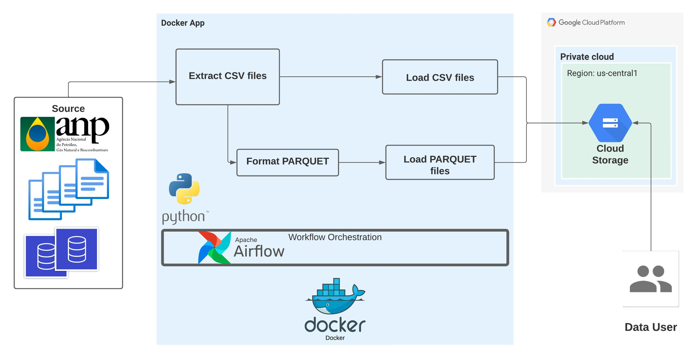

# Ingest ANP price data into GCP datalake

The repository project contains part of the Data Engineering pipeline: data ingestion and workflow orchestration. The main focus is to load data into a Datalake using Docker, Apache Airflow and GCS-Google Cloud Storage (GCP).


## Summary
1. [Case Overview](#case-overview)
2. [Pipeline Architecture](#pipeline-architecture)
3. [Requirements](#requirements)
4. [How It Works](#how-it-works)
5. [Running with Docker](#running-with-docker)

## Case Overview

In our case, looking for working with brazilian open data from the ANP (National Petroleum Agency), which contains historical series and recent data from automotive fuel prices by resale station, since 2004.

The project extracts data in .csv format and ingests it into a cloud datalake. Before inserting it, the data can be transform from .csv to .parquet

The proposal is to make data available in a plataform for transformations, aggregations, historical or incremental analysis and visualizations.

## Pipeline Architecture


## Requirements
- Python 3.9 (project version=3.11), docker-compose
- Docker
- Apache Airflow 2.5 (project version=2.8)

## How It Works

1. Docker containers runs Apache Airflow to workflow orchestration.
Docker runs a lighter version. 
    - Check the block services in `docker-compose.yaml`.
2. DAGs do the work of managing data ingestion
    * Extract of .csv data
    * .csv to .parquet format or customization of output file
    * Data Ingestion into GCP (Datalake GCS)
3. Date iteration (e.g. 2004-2023) and monitoring with Apache Airflow UI

## Running with Docker

1. Clone the repository.
   
    ```bash
    git clone <https://github.com/ribjoao/anp-ingest-datalake.git>
    
    ```
    
3. Check your **`DockerFile`**
    a. Use **`DockerFile`** to build image with Apache Airflow and GCP SDK configuration.
4. Check your `docker-compose.yaml` 
    a. You can use de env_file to set .env file with environment variables (GCP_PROJECT_ID, GCP_PROJECT_ID and others)
    b. Check the code of services ‘x-airflow-common’ and ‘volume’ 
    
    ```
    x-airflow-common:
      &airflow-common
      build:
        context: .
        dockerfile: ./Dockerfile
      env_file:
        - .env
    ```
    
    ```
    volumes:
        - ${AIRFLOW_PROJ_DIR:-.}/dags:/opt/airflow/dags
        - ${AIRFLOW_PROJ_DIR:-.}/logs:/opt/airflow/logs
        - ${AIRFLOW_PROJ_DIR:-.}/plugins:/opt/airflow/plugins
        - ~/.google/credentials/:/.google/credentials:ro
    ```

    c . Check environment variables GCP_PROJECT_ID and GCP_GCS_BUCKET, GOOGLE_APPLICATION_CREDENTIALS, GOOGLE_CLOUD_PROJECT.

6. build using DockerFile and docker-compose.

```bash
docker compose build

```

5. Start the service on Docker:

```bash
docker compose up

```

6. Trigger DAG on the AirFlow UI.
